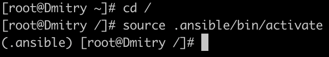

Проект сделан в виртуальном окружении 

Сам playbook выполнился полностью успешно

Дерево playbook

Ответы на вопросы:
Способ 1: Репликация с помощью mysqldump. Создаем дамп на мастере, переносим его на реплику, создаем нового пользователя, применяем дамп на реплике, настраиваем реплику для подключения к мастеру, запускаем реплику
Способ 2: Репликация с использованием xtrabackup. Устанавливаем Percona XtraBackup на обоих серверах, создаем резервную копию, разблокируем таблицы на мастере, переносим резервную копию на сервер-реплику, подготавливаем резервную копию для репликации, копируем данные из резервной копии в дата-директорию реплики, запускаем реплику.

Лучше использовать XtraBackup, так как он поддерживает горячее копирование. Mysqldump прост в использовании, но медленный. Выбор метода зависит от размера базы данных, допустимого времени простоя и доступности ресурсов.
